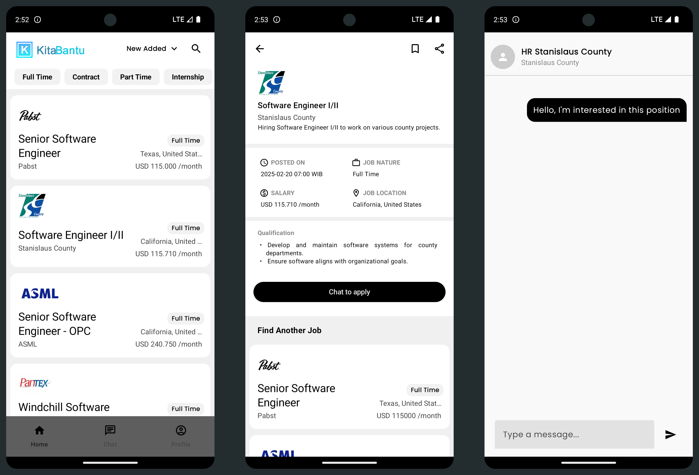

# Kita Bantu Indonesia Challenge App

A job listing application powered by mock data as a challenge from Kita Bantu Indonesia.
Users can:
- Create and manage their profiles.
- Browse and bookmark job listings.
- View detailed job information.
- (Fakely) chat and apply for jobs in a quick, seamless flow.



---

## Features

- **User Profile:** Create or edit your personal profile to stand out to recruiters.
- **Job Listings:** Browse through a curated list of mock jobs across various categories.
- **Job Details:** Tap on a job to see detailed information, requirements, and description.
- **Job Apply (Fake):** Initiate a chat or apply instantly. (All functionality is mocked for demonstration.)
- **Bookmark:** Save interesting jobs to revisit them later.
- **Firebase Authentication:** Secure sign-in and sign-up flow using Firebase.

---

## Tech Stack

- **Kotlin** — 100% Kotlin codebase for modern, concise, and type-safe development.
- **Jetpack Compose** — Declarative UI toolkit for building native Android UIs.
- **Firebase Authentication** — User authentication and management.
- **Dependency Injection** — Simplified code structure with DI frameworks.
- **Retrofit** — Network client with mock API and fake data.

---

## Development

1. **Clone the repository:**

   ```bash
   git clone https://github.com/your-username/your-repo.git
